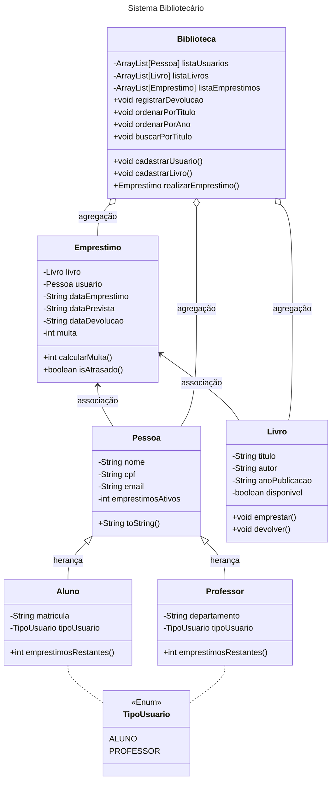

## Como Executar
Para compilar e executar o projeto, utilize o script de build:
./build.sh

## Resumo do Sistema
O sistema será uma aplicação para gerenciamento de uma biblioteca universitária. Ele permitirá o cadastro de livros, usuários (alunos e professores), e o controle de empréstimos e devoluções. Haverá controle de prazos, cálculo de multas por atraso, histórico de empréstimos. O sistema será controlado por uma interface gráfica intuitiva, permitindo uso por bibliotecários e usuários. Os dados serão armazenados em arquivos.

## Funcionalidades
- Cadastrar, editar e remover usuários (alunos e professores)
- Cadastrar e remover livros
- Realizar empréstimos e devoluções
- Calcular multa por atraso na devolução
- Visualizar histórico de empréstimos de um usuário
- Pesquisar livros por título
- Salvar e carregar dados do sistema a partir de arquivos
- Exceções tratadas para dados inválidos ou operações inconsistentes (ex: devolver livro não emprestado)

## Estrutura das Classes
### Classes principais
- Pessoa (Classe abstrata)
Atributos: nome, cpf, email
Métodos: getters/setters, toString()

- Aluno e Professor (herdam de Pessoa)
Atributos específicos: matrícula, departamento
Métodos adicionais: limite diferente de empréstimos

- Livro
Atributos: título, autor, anoPublicacao, disponivel
Métodos: getters/setters, emprestar(), devolver()

- Empréstimo
Atributos: livro, usuario, dataEmprestimo, dataDevolucao, dataPrevista, multa
Métodos: calcularMulta(), isAtrasado()

- Biblioteca
Atributos: listas de usuários, livros e empréstimos (uso de arrays ou listas)
Métodos: cadastrarUsuario(), cadastrarLivro(), realizarEmprestimo(), registrarDevolucao()

## Outros Elementos
- TipoUsuario (enum): ALUNO, PROFESSOR
- Interface Multavel: com método calcularMulta() para polimorfismo
- Exceção personalizada: LivroIndisponivelException, UsuarioNaoEncontradoException, etc.
- Utilização de variáveis e métodos estáticos para controle geral (ex: contador de empréstimos)

## Diagrama UML - em progresso

