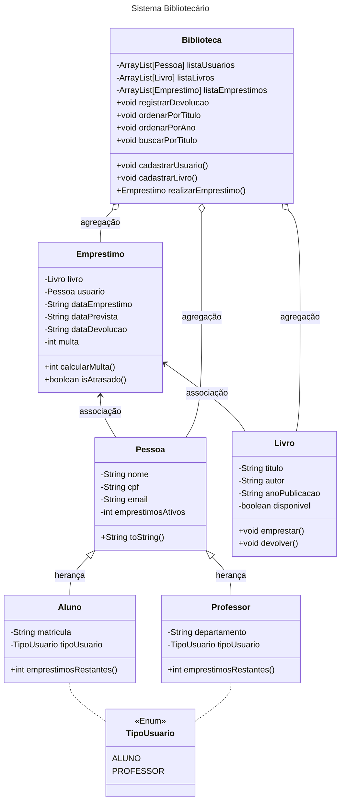

## Como Executar
Para compilar e executar o projeto, utilize o script de build:
./build.sh

## Resumo do Sistema
O sistema será uma aplicação para gerenciamento de uma biblioteca universitária. Ele permitirá o cadastro de livros, usuários (alunos e professores), e o controle de empréstimos e devoluções. Haverá controle de prazos, cálculo de multas por atraso, histórico de empréstimos. O sistema será controlado por uma interface gráfica intuitiva, permitindo uso por bibliotecários e usuários. Os dados serão armazenados em arquivos.

## Funcionalidades
- Cadastrar, editar e remover usuários (alunos e professores)
- Cadastrar e remover livros
- Realizar empréstimos e devoluções
- Calcular multa por atraso na devolução
- Visualizar histórico de empréstimos de um usuário
- Pesquisar livros por título
- Salvar e carregar dados do sistema a partir de arquivos
- Exceções tratadas para dados inválidos ou operações inconsistentes (ex: devolver livro não emprestado)

## Casos de Teste

### Caso 1 - Cadastro de Aluno
- Ação: cadastrar aluno “João da Silva”, CPF 111.111.111-11, matrícula RA123.
- Resultado esperado: aluno criado e armazenado no arquivo `usuarios.txt`.

---

### Caso 2 - Cadastro de Professor
- Ação: cadastrar professor “Dra. Ana”, CPF 222.222.222-22, departamento ENGENHARIA_DA_COMPUTACAO.
- Resultado esperado: professor criado e armazenado no arquivo `usuarios.txt`.

---

### Caso 3 - Cadastro de Livro
- Ação: cadastrar livro “Clean Code”, autor “Robert C. Martin”, ano 2008.
- Resultado esperado: livro cadastrado e disponível para empréstimo.

---

### Caso 4 - Realizar Empréstimo
- Ação: emprestar o livro “Clean Code” para João da Silva (RA123).
- Resultado esperado: status do livro alterado para indisponível, empréstimo registrado com data prevista de devolução em 14 dias.

---

### Caso 5 - Empréstimo de livro já emprestado
- Ação: tentar emprestar “Clean Code” novamente enquanto ele está emprestado.
- Resultado esperado: exceção `LivroIndisponivelException` (ou mensagem de erro na interface).

---

### Caso 6 - Registrar Devolução com atraso
- Ação: devolver o livro “Clean Code” após 20 dias.
- Resultado esperado: sistema calcula multa proporcional (por exemplo R$ 2,50/dia) e retorna o valor da multa.

---

### Caso 7 - Editar usuário
- Ação: alterar o email do aluno João da Silva para “joao@usp.br”.
- Resultado esperado: dados atualizados corretamente no arquivo e na interface.

---

### Caso 8 - Remover usuário com empréstimo ativo
- Ação: tentar remover João da Silva enquanto ainda possui empréstimo ativo.
- Resultado esperado: operação bloqueada com mensagem de erro.

---

### Caso 9 - Pesquisar livro por título
- Ação: pesquisar o termo “Clean”.
- Resultado esperado: lista de livros filtrada contendo “Clean Code”.

---

### Caso 10 - Persistência
- Ação: reiniciar o programa após salvar dados de usuários e livros.
- Resultado esperado: dados são recarregados automaticamente dos arquivos `.txt`.

## Estrutura das Classes
### Classes principais
- Pessoa (Classe abstrata)
Atributos: nome, cpf, email
Métodos: getters/setters, toString()

- Aluno e Professor (herdam de Pessoa)
Atributos específicos: matrícula, departamento
Métodos adicionais: limite diferente de empréstimos

- Livro
Atributos: título, autor, anoPublicacao, disponivel
Métodos: getters/setters, emprestar(), devolver()

- Empréstimo
Atributos: livro, usuario, dataEmprestimo, dataDevolucao, dataPrevista, multa
Métodos: calcularMulta(), isAtrasado()

- Biblioteca
Atributos: listas de usuários, livros e empréstimos (uso de arrays ou listas)
Métodos: cadastrarUsuario(), cadastrarLivro(), realizarEmprestimo(), registrarDevolucao()

## Outros Elementos
- TipoUsuario (enum): ALUNO, PROFESSOR
- Interface Multavel: com método calcularMulta() para polimorfismo
- Exceção personalizada: LivroIndisponivelException, UsuarioNaoEncontradoException, etc.
- Utilização de variáveis e métodos estáticos para controle geral (ex: contador de empréstimos)

## Diagrama UML

